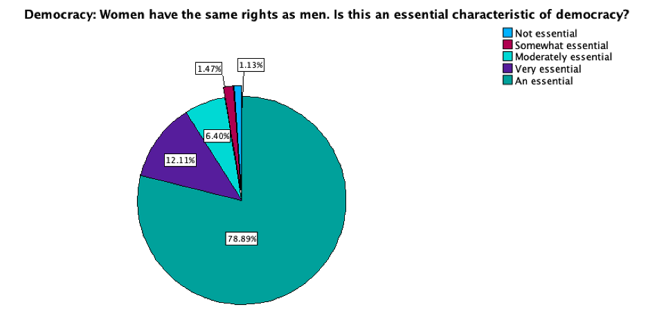
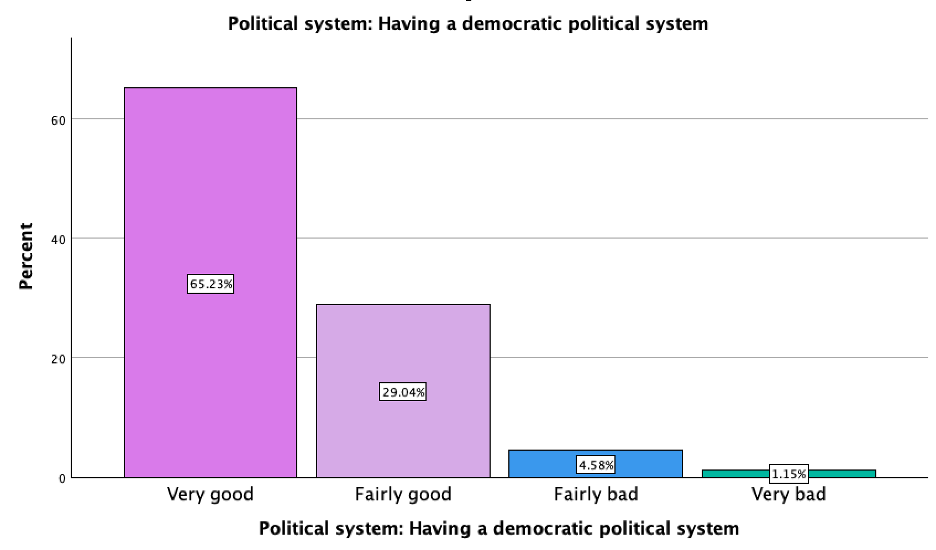

# Univarite Analysis

Calculate relevant univariate descriptive statistics (measures of central tendency and dispersion) and generate an appropriate graphical representation for each of your two variables and insert them here.

### Table 3
*Descriptive statistics for if women have the same rights as men (recode).*

| Statistic  | Value  |
|------------|--------|
| N (Valid)  | 1767   |
| N (Missing)| 21     |
| Median     | 5.0000 |
| Mode       | 5.00   |
| Range      | 4.00   |

### Table 4
*Frequency table for if women have the same rights as men (recode).*

|Valid/Missing  | Category               | Frequency | Percent | Valid Percent | Cumulative Percent |
|--|------------------------|-----------|---------|---------------|--------------------|
|Valid |Not essential          | 20        | 1.1     | 1.1           | 1.1                |
| Valid|Somewhat essential     | 26        | 1.5     | 1.5           | 2.6                |
| Valid|Moderately essential   | 113       | 6.3     | 6.4           | 9.0                |
|Valid |Very essential         | 214       | 12.0    | 12.1          | 21.1               |
|Valid |An essential           | 1394      | 78.0    | 78.9          | 100.0              |
|Valid |Total                  | 1767      | 98.8    | 100.0         |             -       |
|Missing |System                 | 21        | 1.2     |         -      |         -           |
|Total |     -             | 1788      | 100.0   |        -       |       -             |

### Figure 1
*Graphical representation for if womenrightsRecode.*

### Descriptive narrative for womenrightsRecode
A table for descriptive statistics for womenrightsRecode was produced, shown in Table 6.1. The descriptive statistics calculate the measures of central tendency for the ordinal variable. It shows that the Median of people think women rights are ‘an essential’ characteristic of democracy. The Mode for women rights is ‘an essential’ characteristic of democracy (Value Label = 5) was most answered by respondents. These results can be found in Table 6.1.
The measure of dispersion was produced in Table 6.1 and Table 6.2. The range is 4, shown in Table 6.1. A frequency table produced in Table 6.2 shows that 1.1% (n=20) responded not an essential characteristic of democracy, 1.5% (n=26) said ‘somewhat’, 6.4% (n=113) answered ‘moderately essential and 12.1% (n=214) ‘very essential’. The majority of respondents, 78% (n=1394) believed that women having the same rights as men is an essential characteristic of democracy. 
The graphical representation for womenrightsRecode in Figure 6.1 was presented in a Pie Chart with percentages. 

### Table 5
*Descriptive statistics for Political system: Having a democratic political system.*

| Statistic  | Value  |
|------------|--------|
| N (Valid)  | 1746   |
| N (Missing)| 42     |
| Median     | 1.00   |
| Mode       | 1      |
| Range      | 3      |

### Table 6
*Frequency Table for Political system: Having a democratic political system.*

| | Category       | Frequency | Percent | Valid Percent | Cumulative Percent |
|--|----------------|-----------|---------|---------------|--------------------|
| Valid| Very good      | 1139      | 63.7    | 65.2          | 65.2               |
| Valid| Fairly good    | 507       | 28.4    | 29.0          | 94.3               |
| Valid| Fairly bad     | 80        | 4.5     | 4.6           | 98.9               |
| Valid| Very bad       | 20        | 1.1     | 1.1           | 100.0              |
| Valid| Total          | 1746      | 97.7    | 100.0         |                    |
| Missing  | No answer      | 1         | 0.1     |          -     |       -             |
| Missing  | Don’t know     | 41        | 2.3     |        -       |     -               |
| Missing  | Total          | 42        | 2.3     |       -       |            -        |
| | Total          | 1788      | 100.0   |     -          |                -    |

### Figure 2
*Graphical representation for if Democracy*

### Descriptive narrative for democracy

A table for descriptive statistics for democracy was produced, shown in Table 6.3. The descriptive statistics calculate the measures of central tendency for the ordinal variable. The Median of people think they have a ‘very good’ democratic political system (Value label=1). The Mode of people believe that they live in a ‘very good’ democratic political system (Value label=1). 
The measure of dispersion was produced in Table 6.3 and Table 6.4. The range is 4, shown in Table 6.3. A frequency table was produced, Table 6.4, shows that most respondents 65.2% (n=1134) answered a ‘very good’, followed by 29% (n=507) who said, ‘fairly good”. Only 4.6% (n=80) and 1.1% (n=20) said ‘fairly bad’ and ‘very bad’ respectively.
The graphical representation for democracy in Figure 6.2 was presented in a Bar Chart with percentages. 
